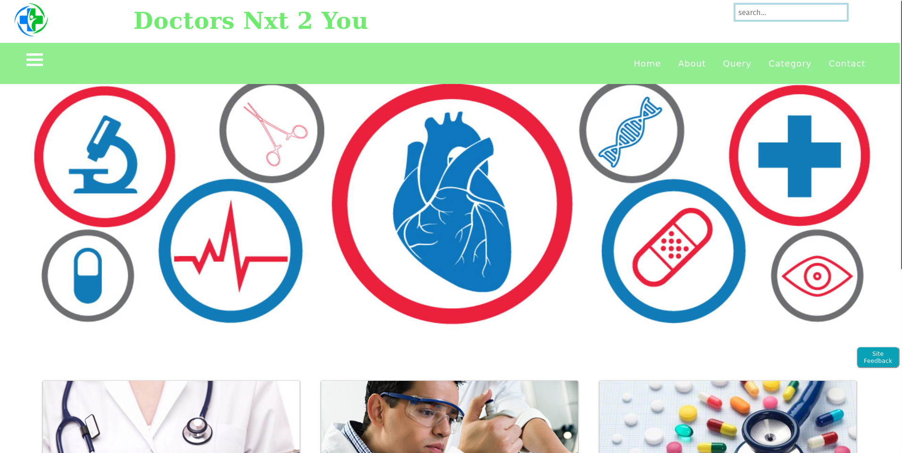
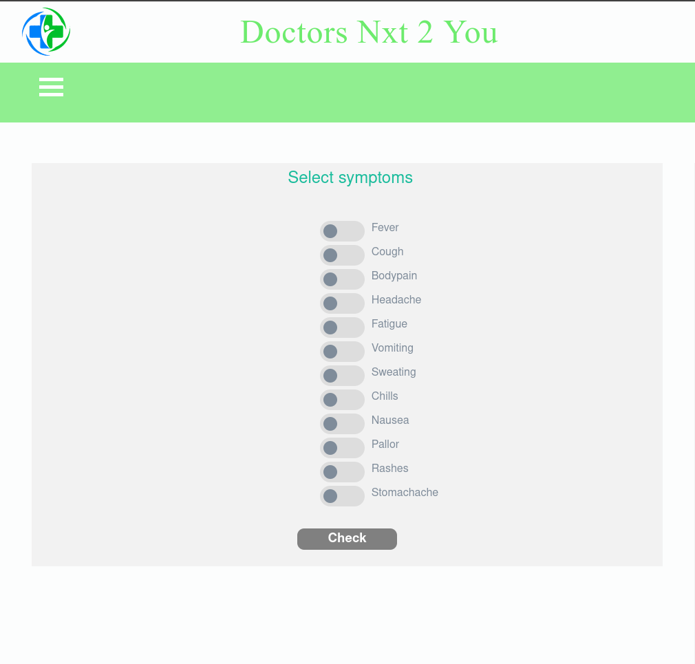
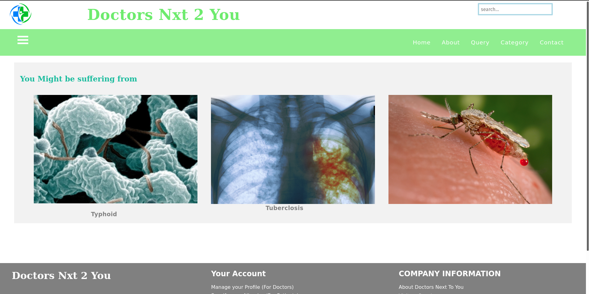
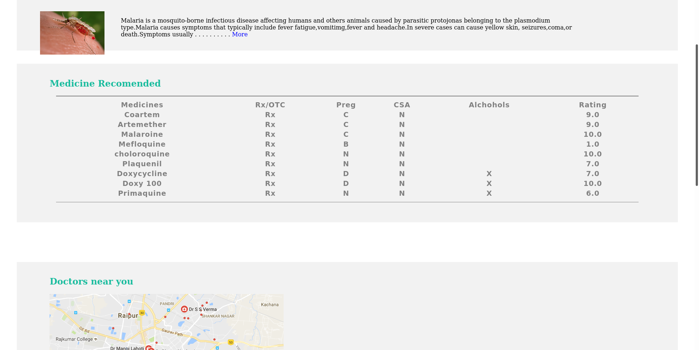

## Project Description - 

The project is made to showcase a template of medical website that can be used to diagnose the disease with symptom checking and give proper recommendation for disease with the results for the doctor that are present in your area as well. The website is static and it is just to showcase the illustration of the design. The website is made using HTML, CSS and JS. The template consist of 4 pages.

### Pages - 

